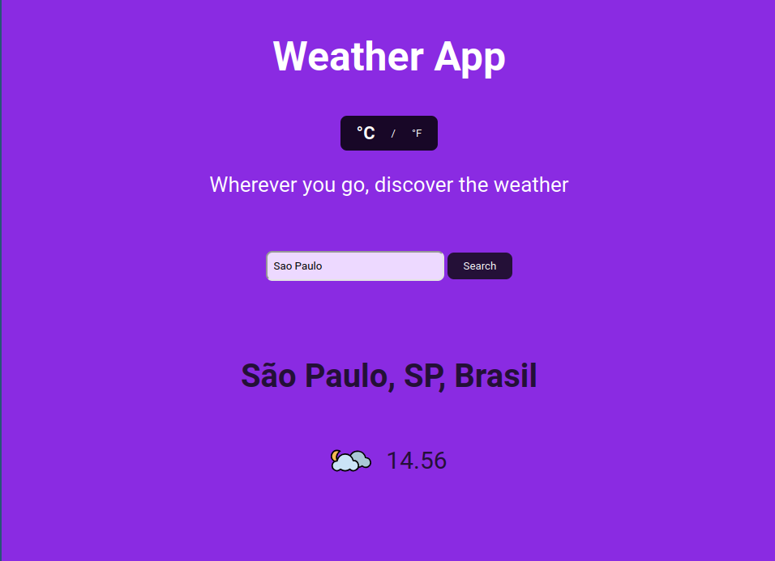

# weather-app

A weather application built with JavaScript, HTML, and CSS. It uses APIs and asynchronous code (callbacks, promises, async/await) to fetch and display current weather information.

Live site: https://t-dlsantos.github.io/weather-app/

Printout of home page:
